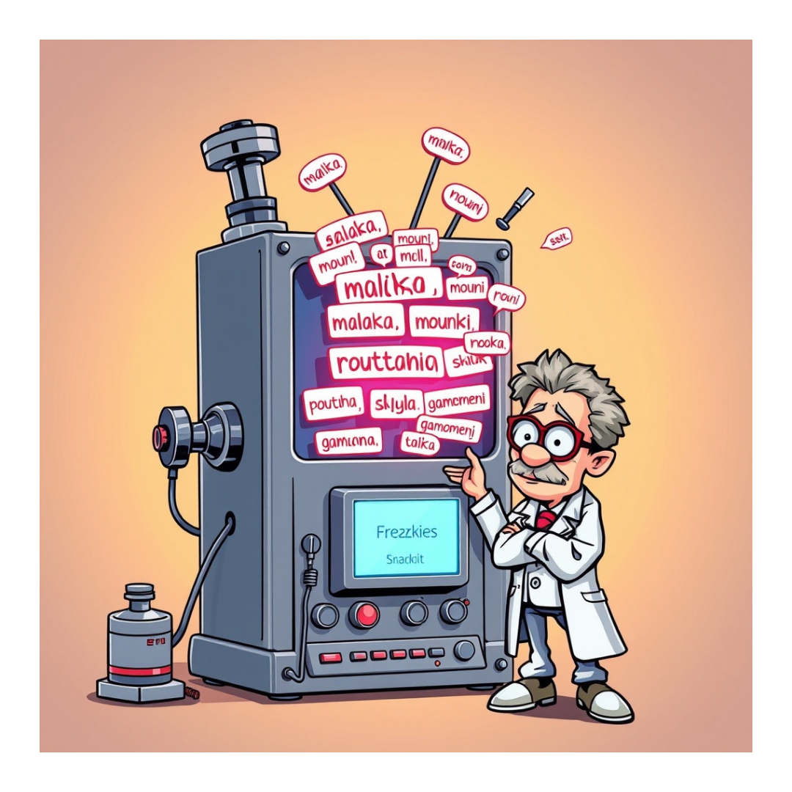

# Greek Insult Phrase Generator



## Description

This project is a fun and random Greek insult phrase generator. The generator combines a collection of common Greek insults and expressions to create humorous phrases. Perfect for learning some colorful language or just for a good laugh!

## Demo

Try the project on:

[https://mpinelikia.xyz](https://mpinelikia.xyz)

## Inspiration

This project was inspired by [**Mpinelikomhxanh**](https://www.insomnia.gr/forums/topic/342444-η-μπινελικομηχανή/), a well-known Greek insult machine. Our version brings the same flavor of humor with a new set of phrases and modern Greek language and of course a web experience (the initial project was a windows app).

## Features

- Generate random Greek insult phrases.
- A growing collection of expressions.
- Easy to use interface.
- Easy to expand and improve

## How to Use
The project is written on PHP / HTML / JS / CSS.
1. Clone the repository to a web server directory:
    ```bash
    git clone https://github.com/Sugarv/greek-insult-generator.git
    ```
2. Open it on your browser.

## Contributions

Feel free to contribute! You can add more phrases or help enhance the functionality of the generator by opening a pull request.

## License

This project is licensed under the MIT License.
